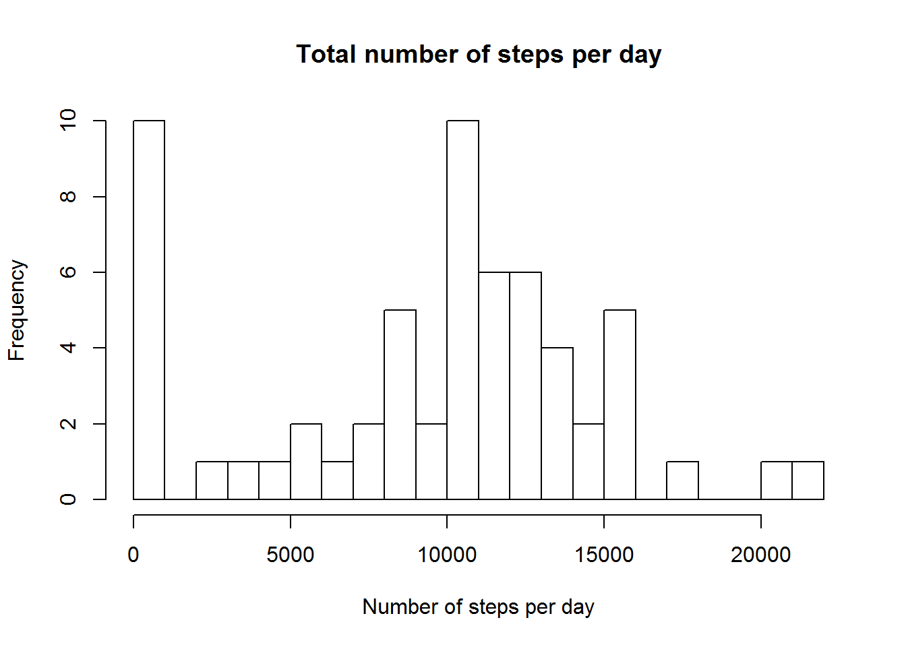
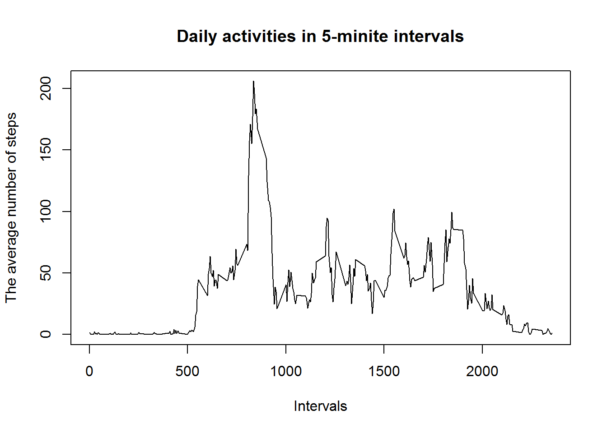
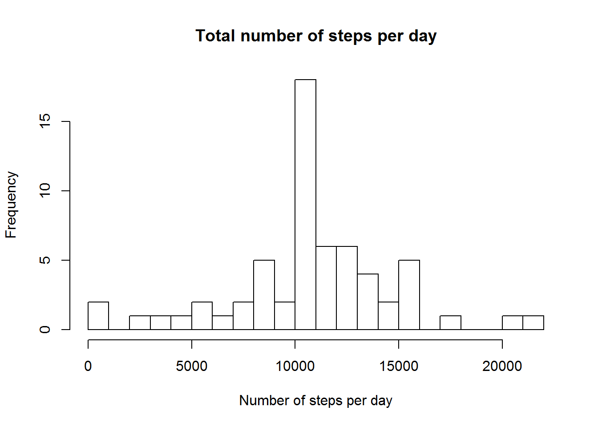
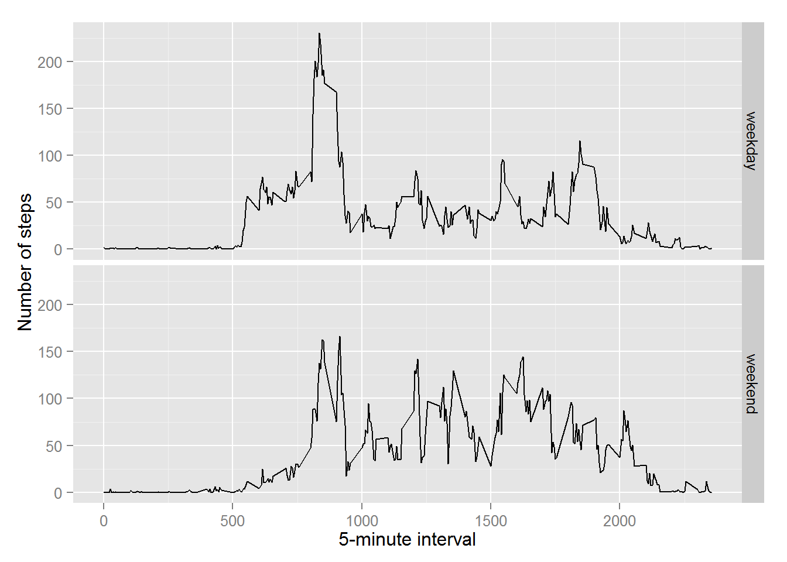

##Loading and preprocessing the data

First, read the .csv file into R and show several lines of the data.


```r
dt <- read.csv("activity.csv", header=T)
head(dt)
```

```
##   steps       date interval
## 1    NA 2012-10-01        0
## 2    NA 2012-10-01        5
## 3    NA 2012-10-01       10
## 4    NA 2012-10-01       15
## 5    NA 2012-10-01       20
## 6    NA 2012-10-01       25
```

Then convert the "date" variable from a *factor* to *date* class variable.


```r
dt$date <- as.Date(dt$date, format="%Y-%m-%d")
```

##What is the mean total number of steps taken per day?

First, make a histogram of the total number of steps taken each day


```r
dt_steps <- aggregate(dt$steps, by=list(dt$date), FUN=sum, na.rm=T)
names(dt_steps)=c("date","steps")
hist(dt_steps$steps, xlab="Number of steps per day", main="Total number of steps per day",breaks=20)
```

 

Then get the mean and median of total steps per day.


```r
avg <- mean(dt_steps$steps,na.rm=T)
med <- median(dt_steps$steps,na.rm=T)
```

The mean total number of steps taken per day is 9354.2295082 and the median is 10395.

##What is the average daily pattern?

Make a time series plot of the 5-minute interval (x-axis) and the average number of steps taken, averaged across all days (y-axis).


```r
dt_interval <- aggregate(dt$steps, by=list(dt$interval), FUN=mean, na.rm=T)
names(dt_interval)=c("interval","steps")
plot(dt_interval$interval, dt_interval$steps, type = "l", col = "Black", 
     main = "Daily activities in 5-minite intervals",
     xlab = "Intervals", ylab = "The average number of steps")
```

 

Find which 5-minute interval, on average across all the days in the dataset, contains the maximum number of steps.

```r
dt_interval[which.max(dt_interval$steps),]
```

```
##     interval    steps
## 104      835 206.1698
```

##Imputing missing values

Calculate and report the total number of missing values in the dataset(i.e. the total number of rows with NAs).


```r
NAs <- is.na(dt$steps)
table(NAs)
```

```
## NAs
## FALSE  TRUE 
## 15264  2304
```

Use the mean for that 5-minute interval to fill all the NA values in the dataset.


```r
for(i in 1:nrow(dt)) {
      if( NAs[i]== T) {
            dt$steps[i] = dt_interval$steps[dt$interval[i] == dt_interval$interval]
      }
}
```

Now, the new dataset is equal to the original dataset but with the missing data filled in.


```r
head(dt)
```

```
##       steps       date interval
## 1 1.7169811 2012-10-01        0
## 2 0.3396226 2012-10-01        5
## 3 0.1320755 2012-10-01       10
## 4 0.1509434 2012-10-01       15
## 5 0.0754717 2012-10-01       20
## 6 2.0943396 2012-10-01       25
```

```r
NAs <- is.na(dt$steps)
table(NAs)
```

```
## NAs
## FALSE 
## 17568
```
Make a histogram of the total number of steps taken each day and Calculate and report the mean and median total number of steps taken per day. 


```r
dt_steps <- aggregate(dt$steps, by=list(dt$date), FUN=sum,na.rm=T)
names(dt_steps)=c("date","steps")
hist(dt_steps$steps, xlab="Number of steps per day", main="Total number of steps per day",breaks=20)
```

 

```r
avg <- as.integer(mean(dt_steps$steps,na.rm=T))
med <- as.integer(median(dt_steps$steps,na.rm=T))
```

The mean total number of steps taken per day is 10766 and the median is 10766.

Do these values differ from the estimates from the first part of the assignment?  
  
Yes.  
  
What is the impact of imputing missing data on the estimates of the total daily number of steps?  
  
Mean and median values are higher after imputing missing data. Because missing steps values were treated as 0s before in the analysis. After replacing missing steps values with the average steps of the interval, the total number of steps taken each day will increase.  
  
##Are there differences in activity patterns between weekdays and weekends?
First, create a new factor variable in the dataset with two levels ¨C ¡°weekday¡± and ¡°weekend¡± indicating whether a given date is a weekday or weekend day.  


```r
Sys.setlocale("LC_TIME", "English")
```

```
## [1] "English_United States.1252"
```

```r
days = weekdays(dt$date)
table(days)
```

```
## days
##    Friday    Monday  Saturday    Sunday  Thursday   Tuesday Wednesday 
##      2592      2592      2304      2304      2592      2592      2592
```

```r
isweekend =  days == "Sunday" | days == "Saturday"
dt$day = factor(as.integer(isweekend), levels=c(0, 1), labels=c("weekday", "weekend"))
summary(dt)
```

```
##      steps             date               interval           day       
##  Min.   :  0.00   Min.   :2012-10-01   Min.   :   0.0   weekday:12960  
##  1st Qu.:  0.00   1st Qu.:2012-10-16   1st Qu.: 588.8   weekend: 4608  
##  Median :  0.00   Median :2012-10-31   Median :1177.5                  
##  Mean   : 37.38   Mean   :2012-10-31   Mean   :1177.5                  
##  3rd Qu.: 27.00   3rd Qu.:2012-11-15   3rd Qu.:1766.2                  
##  Max.   :806.00   Max.   :2012-11-30   Max.   :2355.0
```
Make a panel plot containing a time series plot of the 5-minute interval (x-axis) and the average number of steps taken, averaged across all weekday days or weekend days (y-axis).  


```r
library(ggplot2)
```

```
## Use suppressPackageStartupMessages to eliminate package startup messages.
```

```r
dt_days <- aggregate(steps ~ interval + day, data=dt, mean)
ggplot(dt_days, aes(interval, steps)) + geom_line() + facet_grid(day ~ .) +
    xlab("5-minute interval") + ylab("Number of steps")
```

 
